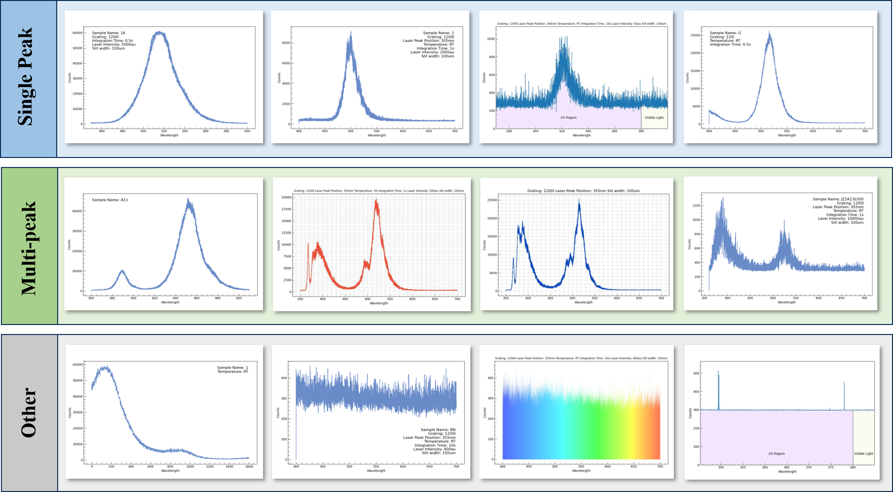
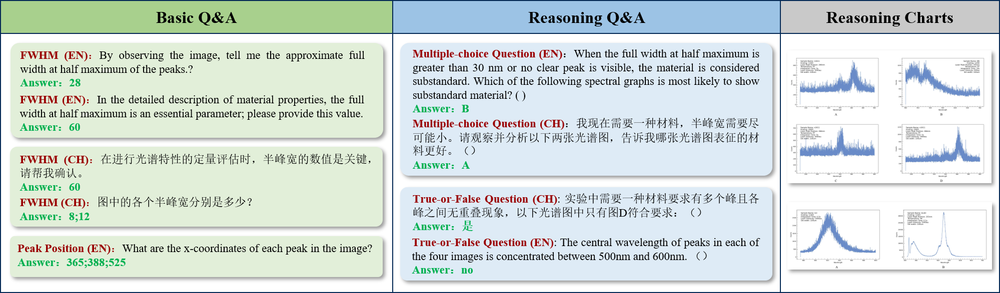

# 📊 SciChart
## 👋 Introduction

Chart data are widely used in fields like medical and scientific research. For Multimodal Large Language Models (MLLMs), understanding charts is essential for both visual perception and reasoning across charts and text. Chart Question Answering (Chart QA), as a manifestation of Information Retrieval (IR), is crucial for facilitating the efficient and context-sensitive extraction of insights from visual data representations. However, most existing Chart QA datasets are monolingual and contain simple reasoning questions, making current evaluation benchmarks inadequate for the rapid advancements in MLLM performance. Therefore, we propose a multilingual scientific spectral Chart QA dataset, termed SciChart. We design two tasks, basic question answering (BasicQA) and reasoning-based question answering (ReaQA), to evaluate the models' ability to 1) directly extract information from charts, and 2) understand the textual and visual information for reasoning. We build 1,100 ReaQA and over 10,000 BasicQA samples. All samples are manually curated and annotated by human experts. We also conduct extensive experiments with state-of-the-art models to establish SciChart benchmarks. The experimental results show a huge gap between the performance of existing models (GPT-4o 39.47%) and humans (80.01%). The RAG-based GPT-4o model shows only marginal improvements in the ReaQA task, with challenges in retrieving relevant chart features for complex reasoning. Language differences also impact performance, highlighting the need for better multilingual reasoning.

<div align=center>

</div>

<div align=center>

</div>

## Image Data
Please download image data to **data/img** from link: https://drive.google.com/file/d/1M3kzYqLK26KLHJIeHx9EjdhId-RFvUig/view?usp=drive_link

## Requirements
* Python 3.8+
* PyTorch 2.0+
* CUDA 11.4+ (★ Required for GPU acceleration)
* API for GPT services
<br>

## 🛠️ Quick Start
### 1. Environment Setup
```bash
# Install dependencies
pip install -r requirements.txt

# Set API key (in ~/.bashrc or system environment)
export API_KEY="your_api_key_here"
```
### 2. Main Module
#### 2.1 Chart Question Answering (Proprietary Models)
```bash
python API.py
```
**Workflow:**  
1. Select dataset from **data/**  
2. Configure task-specific instructions in instructions.py
3. Modify the API in designated configuration section
4. Results output to **output/**
#### 2.2 GPT-acc Evaluation
```bash
python eval_gptacc.py
```
**Workflow:**  
1. Select dataset from **output/** when conducted
2. Evaluation results are displayed directly and saved
#### 2.3 Relaxed-acc Evaluation
```bash
python eval_relaxedacc.py
```
**Workflow:** 
1. Select dataset from **output/** when conducted
2. Evaluation results are displayed directly and saved
#### 2.4 instructions
```bash
vim instructions.py
```

## Contact Us

Email to yuetan@pku.edu.cn
