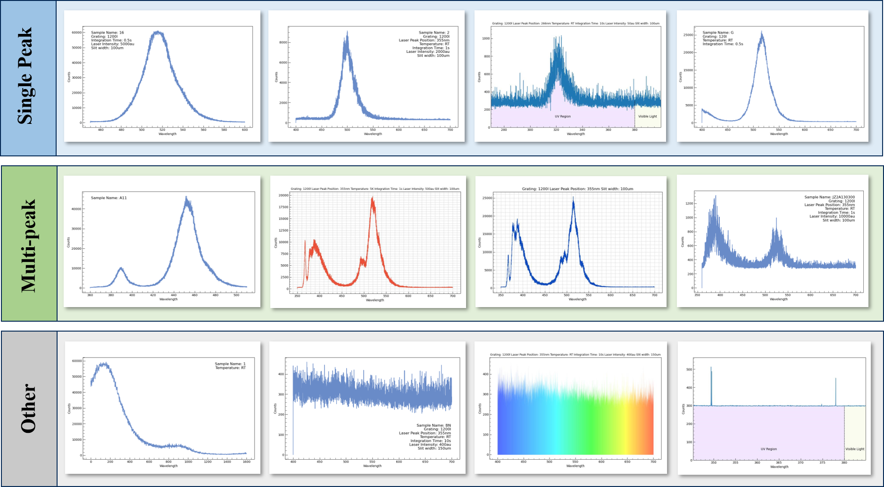
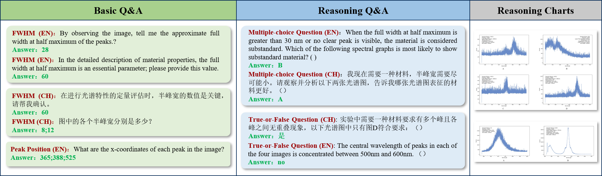

# 📊 SciChart
This repository contains the code to evaluate models on SciChart from the paper [SciChart: Visual Question Answering and Reasoning for
 Scientific Spectral Chart].

*🤗 This codebase is released as Version v1.0. We are dedicated to its continuous improvement. If you have any questions or suggestions, you are welcome to open an issue or submit a pull request for new features or bug fixes.*

## 👋 Introduction

Charts play a pivotal role in scientific research, offering a concise and visual way to present complex data. For Multimodal Large Language Models (MLLMs), the ability to comprehend charts is critical, as it requires both visual perception and reasoning that bridges graphical and textual information. However, existing Chart QA datasets are monolingual with simple questions, making current evaluation benchmarks inadequate for the rapid advancements in MLLM performance. Therefore, we propose a multilingual scientific spectral Chart QA dataset, termed SciChart. We design two tasks, basic question answering (BasicQA) and reasoning-based question answering (ReaQA), to evaluate the models' ability to 1) directly extract information from charts, and 2) understand the textual and visual information for reasoning. We build 1,100 ReaQA and over 10,000 BasicQA samples. All samples are manually curated and annotated by human experts. We also conduct extensive experiments with state-of-the-art models to establish SciChart benchmarks. Experimental results show a huge gap between the performance of existing models (Claude-3.7 45.12%) and humans (83.84%).

<div align=center>

</div>

<div align=center>

</div>

## Data Structure
 Responses are generated using queries as input, which contain  the charts and questions that SciChart uses to evaluate models. The structure is as follows:
```
{
    "1": {
        "image_id": ...<str>,
        "question_type": ...<str>,
        "question": ...<str>,
        "answer": ...<str>
    },
    "2": {
        "image_id": ...<str>,
        "question_type": ...<str>,
        "question": ...<str>,
        "answer": ...<str>
    }
    ...
}
```
## Image Data
Please download image data to **data/** from link: https://drive.google.com/file/d/1M3kzYqLK26KLHJIeHx9EjdhId-RFvUig/view?usp=sharing

## Requirements
* Python 3.8.10+
* PyTorch 2.0+
* CUDA 11.4+ (★ Required for GPU acceleration)
* API for proprietary models' services (such as GPT)
<br>

## 🛠️ Quick Start
### 1. Environment Setup
```bash
git clone https://github.com/yuetanbupt/SciChart.git
cd data
wget -O img.zip https://drive.usercontent.google.com/download?id=1M3kzYqLK26KLHJIeHx9EjdhId-RFvUig&export=download&confirm=t&uuid=d3c1008e-140e-493f-8444-b267c005f41b
unzip img.zip && rm img.zip
# Install dependencies
pip install -r requirements.txt

# Set API key (in ~/.bashrc or system environment)
export API_KEY="your_api_key_here"
```
### 2. Main Module
#### 2.1 Chart Question Answering (Proprietary Models)
Chart question-answering tasks are divided into two major categories: `BasicQA` and `ReaQA`, for which different datasets and large models can be selected for evaluation respectively.
```bash
python API.py
```
🗄️ After executing the file, select a `dataset` from the `data/` folder as prompted for input. When the file finishes running, the `results` will be saved in the `output/` folder. Configure the `instructions` for specific tasks in the `instructions.py` .You can manually change the `model` used in the file. 
#### 2.2 GPT-acc Evaluation
Use the method of scoring by a `LLM` to score the answers generated by the previous LLM.
```bash
python eval_gptacc.py
```
🗄️ Select the file to be scored from the `output/` folder. The final results will be directly printed in the console and saved in the `output/` folder. You can manually change the large model used for evaluation in `gpt_acc.py`.
#### 2.3 Relaxed-acc Evaluation
Use a `rule-based` method to score the files previously generated by the LLM.
```bash
python eval_relaxedacc.py
```
🗄️ Select the file to be scored from the `output` folder. The final results will be printed directly in the console and saved in the `output` file.
#### 2.4 instructions
You can view and change the default instructions for each task configuration in the instructions.py file.
```bash
vim instructions.py
```
## 🏆 Benchmark Results
The main results (BasicQA & ReaQA) of the SciChart.

| Model         | Open Source | G-acc | R-acc | Avg.  |
|:--------------|:-----------:|------:|------:|------:|
| Human         | -           | -     | -     | 83.84 |
| ChartVLM      | ✔           | 16.26 | 6.21  | 11.23 |
| Claude-3-haiku| ✗           | 26.88 | 14.77 | 20.83 |
| Qwen-VL       | ✔           | 25.21 | 24.83 | 25.02 |
| GPT-4o-mini   | ✗           | 33.80 | 31.65 | 32.73 |
| Gemini-pro-v  | ✗           | 41.11 | 41.22 | 41.17 |
| Gemini-2.0-T  | ✗           | 40.91 | 45.19 | 43.05 |
| GPT-4o        | ✗           | 41.93 | 47.44 | 44.68 |
| Claude-3.7-T  | ✗           | 43.64 | 46.60 | 45.12 |

## 📜 License
Our original data contributions are distributed under the MIT license.

## 🙌 Contributors and Acknowledgement
**📊 SciChart is developed by a team consisting of:**  
Yue Tan, Rui Mao, Xuzhao Shi, Zilong Song, Siyuan Xu, Yu Yan, Ziyuan Liao, Zonghai Hu, Dongyan Zhao 

WICT, Peking University  
Beijing University of Posts and Telecommunications  
Nanyang Technological University   

🤗 We sincerely appreciate the contributors of open-source annotation tools, whose work improved the efficiency and quality of our human annotation process.   

🤗 Additionally, we acknowledge the support from the State Key Laboratory of General Artificial Intelligence (SKLGAI), which provided crucial computational resources and academic guidance for this research.
## Contact Us

Email to yuetan@pku.edu.cn
